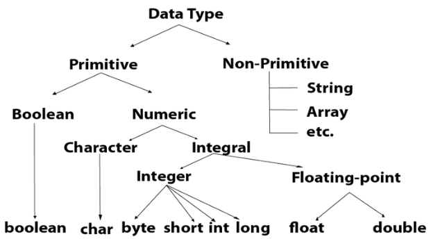
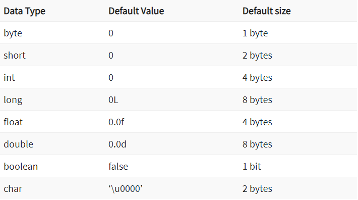
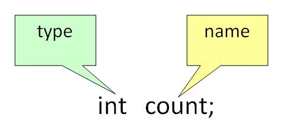

# Chapter 01 - Java Dasar

### Daftar Isi
- [Terminologi Umum](#terminologi-umum-pada-java)
  - [Class](#1-class)
  - [Object](#2-object)
  - [Method](#3-method)
  - [Instance Variables](#4-instance-variables)
- [A. Sintaks Dasar](#a-sintaks-dasar)
  - [1. Komentar pada Java](#1-komentar-pada-java)
  - [2. Penamaan *File*](#2-penamaan-file)
  - [3. *Case Sensitivity*](#3-case-sensitivity)
  - [4. Penamaan Kelas (*Class Names*)](#4-penamaan-kelas-class-names)
  - [5. *public static void main(String [] args)*](#5-public-static-void-mainstring--args)
  - [6. Penamaan Method (*Method Names*)](#6-penamaan-method-method-names)
  - [7. *Identifiers*](#7-identifiers)
  - [8. *White Spaces*](#8-white-spaces)
  - [9. *Access Modifiers*](#9-access-modifiers)
  - [10. Memahami *Access Modifiers*](#10-memahami-access-modifiers)
  - [11. *Keywords*](#11-keywords)
- [B. Tipe Data dan Variabel](#b-tipe-data-dan-variabel)
  - [1. Tipe Data (*Data Types*)](#1-tipe-data-data-types)
    - [Tipe Data Primitive](#tipe-data-primitive)
    - [Tipe Data Non-primitive](#tipe-data-non-primitive)
    - [*Type Conversion and Type Casting*](#type-conversion-and-type-casting)
  - [2. Variabel](#2-variabel)
    - [Deklarasi Variabel](#deklarasi-variabel)
    - [Inisialisasi Variabel](#inisialisasi-variabel)


## Terminologi umum pada Java
Ada beberapa terminologi atau istilah umum pada Java, antara lain:
### 1. Class
  Class adalah cetak biru (*blueprint*) dari Object (*instance of class*). Secara sederhananya, Class bisa diartikan **cetakan** dari Object.<br>
  **Contoh:**
  * Cetakan (*Blueprint*) dari rumah adalah sebuah **Class.**
  * Pada dunia nyata, misalkan Kamu memiliki kawan bernama Samsul. Maka,  Kamu dan Samsul adalah Object (*instance of class*) dari Class yang  bernama **Manusia.**<br>

### 2. Object
  Object adalah hasil cetakan dari Class (*instance of class*). Object adalah entitas yang dihasilkan dari Class sehingga memiliki kondisi (*state*) dan perilaku (*behavior*) sesuai dengan Class yang menjadi *instance*-nya.<br>
  * **Contoh:** Saya, Kamu dan Semua orang adalah Object yang dihasilkan oleh **Class Manusia.**
  * **Behavior:** Mengucapkan selamat ulang tahun.<br>

### 3. Method
  Perilaku yang dimiliki oleh sebuah Object disebut **Method.**<br>
  * **Contoh:** Indikator bahan bakar menunjukan jumlah bahan bakar yang tersisa.

### 4. Instance variables
  Instance variables adalah kumpulan variabel unik yang dimiliki oeh Object.</br>
  * **Contoh:** Nama, usia, tinggi badan, berat badan dll.

[top ↑](#daftar-isi)<br><br>

## A. Sintaks Dasar
### 1. Komentar pada Java
  Komentar biasanaya berupa penjelasan pada kode program. komentar akan diabaikan (tidak dikompilasi) sehingga tidak akan mengganggu jalanya program. setidaknya ada 3 tipe komentar pada Java, diantaranya:
  - *Single-line Comment*
  ```Java
  // System.out.println("This is single comment.");

  ```
  - *Multi-line Comment*
  ```Java
  /*
    System.out.println("This is the first line comment.");
    komentar lain
    System.out.println("This is the second line comment.");
  */
  ```
  - *Documentation Comment*
  ```Java
  /** documentation */
  ```

### 2. Penamaan *File*
  Penamaan *file* tidak bisa sembarangan. Jika sebuah *file* memiliki kelas publik (***public class name***) maka nama *file* harus sama dengan nama *public class* tersebut. jika tidak memiliki kelas publik, maka nama *file* boleh berbeda dengan nama *class*. <br>
  Asumsikan kamu memiliki sebuah kelas publik bernama **BasicSyntax**.
  ```
  BasicSyntax.java // valid

  Basic-Syntax.java // invalid

  basicsyntax.java // invalid
  ```

### 3. *Case Sensitivity*
  Java adalah bahasa yang memperhatikan huruf besar kecil (*case-sensitive*), artinya deklarasi AB tidak sama dengan Ab.
  ```Java
  System.out.println("GeeksforGeeks"); // valid

  system.out.println("GeeksforGeeks"); // invalid karena huruf pertama pada keyword System seharusnya kapital. 
  ```

### 4. Penamaan Kelas (*Class Names*)
  Sama seperti penamaan *file*, penamaan kelas pada java juga memiliki aturan.<br>
  - Kata pertama pada nama kelas disarankan kapital. huruf kecil sebenernya valid akan tetapi tidak diasarankan.
  - Jika nama kelas terdiri dari 2 kata atau lebih, maka kata pertama setiap kata harus kapital (**PascalCase** - [casings](https://medium.com/@code.ceeker/naming-conventions-camel-case-pascal-case-kebab-case-and-more-dc4e515b9652)).
  - Tanda **underscore** diperbolehkan, tapi tidak disarankan.
  - Angka dan simbol **currency** diperboehkan, tapi tidak disarankan.
  ```Java
  class MyJavaProgram    // valid
  class 1Program         // invalid
  class My1Program       // valid
  class $Program         // valid, tapi tidak disarankan
  class My$Program       // valid, tapi tidak disarankan (biasanya penamaan kelas seperti ini hanya untuk tujuan khusus)
  class myJavaProgram    // valid, tapi tidak disarankan
  ```

### 5. *public static void main(String [] args)*
  Method main adalah pintu masuk utama ke dalam program Java yang dibuat. Di sinilah pemrosesan dimulai. method main juga bisa ditulis seperti ini:
  ```Java
  public static void main(String… args){
    // ...
  };
  ```

### 6. Penamaan Method (*Method Names*)
 Berbeda degan penamaan kelas yang mengikuti *casing PascalCase*, penamaan method pada Java mengikuti *casing camelCase*. <br>
 jika nama method terdiri dari 1 kata saja maka nama method ditulis dengan huruf kecil.
 ```java
 public void run() // valid
 public void Eat() // valid, tapi tidak disarankan
 ```
 Jika nama method terdiri dari 2 kata ataun lebih, maka huruf pertama pada kata pertama ditulis kecil, sementara huruf pertama pada kata kedua dan seterusnya ditulis kapital.
 ```Java
 public void createProfile() // valid
 public void CreateProfile() // valid, tapi tidak disarankan.
 ```

### 7. *Identifiers*
  *Identifiers* adalah segala nama variabel lokal, variabel *instance*, variabel kelas, labels, juga termasuk nama kelas, paket (*packages*), modul, method. *Identifiers* memiliki beberapa aturan:
  - Semua *identifier* bisa diawali dengan huruf, simbol *currency*, atau tanda **underscore**. Penamaan vaiabel hendaknya huruf kecil.
  - *Identifier* juga bisa kombinasi antara huruf, simbol dan **underscore**. walaupun demikian, variabel tidak disarankan menggunakan **underscore**, dan untuk variabel yang merupakan konstanta (**constant**) disarankan menggunakan huruf kapital seluruhnya.
  - *Identifier* adalah *case-sensitive*, artinya AB tidak sama dengan dengan Ab, tidak sama dengan aB, tidak sama dengan ab.
  - *keyword* bawaan Java tidak bisa digunakan sebagai *identifier*. artinya *keyword* seperti (*class, public, void, final, etc*) tidak bisa digunakan untuk *identifier*.
  ```Java
  // legal
  MinNumber, total, ak74, hello_world, $amount, _under_value

  // illegal
  74ak, -amount
  ```

### 8. *White Spaces*
  *white space* semisal spasi dan tab akan diabaikan oleh kompiler.
### 9. *Access Modifiers*
  *Modifier* atau pengubah adalah pengontrol yang mengontrol ruang lingkup (*scope*) dari kelas dan *method*.
  * ***Access Modifiers:*** default, public, protected, private.
  * ***Non-access Modifiers:*** final, abstract, static, transient, synchronized, volatile, native.

### 10. Memahami *Access Modifiers*
  | ***Access Modifier*** | **Whitin Class** | **Whitin Package** | **Outside Package by subclass only** | Outside Package |
  | --------------------- | ---------------- | ------------------ | ------------------------------------ | --------------- |
  | **Private**           | Yes              | No                 | No                                   | No              |
  | **Default**           | Yes              | Yes                | No                                   | No              |
  | **Protected**         | Yes              | Yes                | Yes                                  | No              |
  | **Public**            | Yes              | Yes                | Yes                                  | Yes             |

### 11. *Keywords*
  *Keywords* atau *Reserved words* adalah kata-kata pada bahasa pemrograman yang digunakan untuk menjalankan beberapa proses internal atau mewakili beberapa tindakan. Kata-kata ini **tidak boleh digunakan** untuk deklarasi variabel atau Object.
  |          |            |           |            |        |              |
  | -------- | ---------- | --------- | ---------- | ------ | ------------ |
  | abstract | assert     |           |            |        |              |
  | boolean  | break      | byte      |            |        |              |
  | case     | catch      | char      | class      | const  | continue     |
  | default  | do         | double    |            |        |              |
  | else     | enum       | extends   |            |        |              |
  | final    | finally    | float     | floor      |        |              |
  | goto     |            |           |            |        |              |
  | if       | implements | import    | instanceof | int    | interface    |
  | long     |            |           |            |        |              |
  | native   | new        |           |            |        |              |
  | package  | private    | protected | public     |        |              |
  | return   |            |           |            |        |              |
  | short    | static     | strictfp  | super      | switch | synchronized |
  | this     | throw      | throws    | transient  | try    |              |
  | void     | volatile   | while     |            |        |              |

[top ↑](#daftar-isi)<br><br>

## B. Tipe Data dan Variabel
### 1. Tipe Data (*Data Types*)
  Tipe data pada Java didefinisikan sebagai penentu yang mengalokasikan berbagai ukuran dan tipe nilai yang dapat disimpan dalam variabel atau *identifier*. <br> <br>
  

  #### Tipe Data Primitive
  Tipe data primitive adalah tipe data dasar yang merepresentasikan sederhana. Tipe data ini direferensikan langsung oleh nilai sebenarnya dan tidak memiliki metode atau properti tambahan yang terkait denganya.<br>
  Pada Java, tipe data primitive **meliputi:** boolean, char, byte, short, int, long, float, dan double.
  - **Boolean**<br>
    Boolean digunakan untuk memnyimpan dua kemungkinan nilai yaitu **true** dan **false**.<br>
    Contoh: <br>
    ```Java
    boolean isHuman = true;
    Boolean bool_isHuman = true;
    // walaupun Boolean adalah kelas, akan tetapi tetap termasuk tipe data primitive karena Boolean adalah representasi dari boolean.
    // dalam banyak kasus, boolean lebih banyak digunakan dibanding Boolean karena lebih efisien.
    ```

  - **Char**<br>
    Char adalah karakter UNICODE 16 *bit* tunggal. Char digunakan untuk menyimpan sebuah karakter.<br>
    Contoh:
    ```Java
    char a = 'A';
    Character char_a = 'A';
    ```

  - **Byte**<br>
    Byte digunakan untuk menyimpan data dalam bentuk byte (8 bit). Kisaran nilai yang dapat disimpan antara **-128 (minimum) hingga 127 (maksimum)**. sementara untuk nilai defaultnya 0.<br>
    Byte biasanya digunaka untuk menyimpan dalam array besar yang paling memerlukan penghematan memori. Selain itu, dapat pula digunakan untuk pengganti tipe data int. <br>
    Contoh:<br>
    ```Java
    byte a = 10;
    Byte byte_a = 127;
    ```

  - **Short**<br>
    Short digunakan untuk menyimpan tipe data dalam  bentuk (16 bit). Kisaran nilai yang dapat disimpan antara **-32,768 (minimum) hingga 32,767 (maksimum)**. Nilai defaultnya adalah 0.<br>
    Contoh:<br>
    ```Java
    short a = 10000;
    Short short_a = -32768;
    ```

  - **Int**<br>
    Int digunakan untuk menyimpan tipe data dalam  bentuk (32 bit). Kisaran nilai yang dapat disimpan antara **-2,147,483,648 hingga 2,147,483,647**. Nilai defaultnya adalah 0.<br>
    Tipe data int umumnya digunakan sebagai tipe data default untuk nilai integral kecuali jika tidak ada masalah dengan memori.<br>
    Contoh:<br>
    ```Java
    int a = 100000;
    Integer int_a = -32768;
    ```

  - **Long**<br>
    Long digunakan untuk menyimpan tipe data dalam  bentuk (64 bit). Kisaran nilai yang dapat disimpan antara **-9,223,372,036,854,775,808 hingga 9,223,372,036,854,775,807**. Nilai defaultnya adalah 0.<br>
    Tipe data long umumnya digunakan sebagai tipe data default untuk nilai integral kecuali jika tidak ada masalah dengan memori.<br>
    Contoh:<br>
    ```Java
    long a = 100000L;
    Long long_a = -32768L;
    ```

  - **Float**<br>
    Tipe data float adalah *floating point IEEE* 754 32-bit presisi tunggal. **Rentang nilainya hampir tidak terbatas**. Walaupun aslinya memiliki batasan sekitar antara **-3.4028235 x 10^38 hingga sekitar 3.4028235 x 10^38**. Disarankan untuk menggunakan float (bukan double) jika Anda perlu menghemat memori dalam array besar angka floating point. Tipe data float **tidak boleh digunakan untuk nilai yang tepat, seperti mata uang**. Nilai defaultnya adalah 0,0F.<br>
    Contoh:<br>
    ```Java
    float a = -234.5F;
    Float float_a = 234.5F;
    ```

  - **Double**<br>
    Tipe data double adalah floating point IEEE 754 64-bit presisi ganda. Kisaran nilainya **hampir tidak terbatas**. Tipe data double umumnya digunakan untuk nilai desimal seperti float. Tipe data ganda juga **tidak boleh digunakan untuk nilai yang tepat, seperti mata uang**. Nilai defaultnya adalah 0,0d.<br>
    Contoh:<br>
    ```Java
    double a = 12.3;
    Double double_a = 3.14;
    ```
  <br>

  <br>
  ***Penting untuk diingat:***
  - 1 *byte* setara dengan 8 *bit*.
  - Semua tipe data *numeric* memiliki tanda/*signed*(+/-).
  - Ukuran tipe data selalu sama disemua platform (terstandarisasi).
  - Tipe data char memiliki ukuran 2 *bytes* karena menggunakan kumpulan karakter UNICODE. **UNICODE** adalah kumpulan karakter yang mencakup semua skrip dan bahasa yang dikenal di dunia.

  #### Tipe Data Non-primitive
  Tipe data Non-primitive atau tipe data referensi adalah tipe data yang merepresentasikan objek di dalam Java. Tipe data ini tidak menyimpan nilai secara langsung di dalamnya, tetapi menyimpan referensi atau alamat ke objek yang sebenarnya disimpan di *heap memory*. Tipe data ini juga dapat memiliki *method* dan properti tambahan yang terkait dengan objek tersebut.<br>
  Pada Java, tipe data non-primitive **meliputi:** String, Class, Array, Interface dll.

  #### *Type Conversion  and Type Casting*
  - ***Type Conversion*** <br>
    *Type conversion* adalah konversi nilai dari satu tipe data ke tipe data yang lain secara otomatis oleh kompiler.<br>
    **Cara kerja**:<br>
    Java secara otomatis melakukan *type conversion* jika diperlukan untuk mempertahankan kesesuaian tipe data dalam ekspresi atau operasi tertentu.<br>
    **Contoh**:<br>
    ```Java
    int numInt = 10;
    float numFloat = 5.5f;
    float result = numInt * numFloat;
    // numInt akan dikonversi menjadi float sebelum perkalian dilakukan.
    ```

  - ***Type Casting*** <br>
    *Type Casting* adalah tindakan yang dilakukan secara manual untuk mengubah tipe data dari satu bentuk ke bentuk lain.<br>
    **Cara kerja**:<br>
    Berbeda dengan *type conversion*, pada *type casting*, Anda secara eksplisit menyatakan tipe data yang ingin Anda ubah, dan jika tipe data tujuan dapat menerima nilai dari tipe data asal, maka konversi akan berhasil.
    <br>
    **Contoh**:<br>
    ```Java
    double numDouble = 10.5;
    int numInt = (int) numDouble;
    // double numDouble akan dikonversi menjadi int secara eksplisit.
    ```
[top ↑](#daftar-isi)<br>

### 2. Variabel
  #### Deklarasi Variabel
  Untuk mendeklarasikan variabel kita perlu menentukan **tipe** dan **nama** variabel. Nama variabel **harus unik** untuk mencegah konflik.<br>
  
  **Contoh:**
  ```Java
  String firstName, fullName;
  String name;
  ```

  #### Inisialisasi Variabel
  Untuk menginisialisasi variabel, kita harus memberi nilai yang valid. <br>
  **Contoh:**
  ```Java
  String name;
  name = "Purnomo";
  ```
  Kita bisa juga deklarasi sekaligus inisialisasi variabel seperti contoh dibawah. <br>
  ```Java
  String name = "Purnomo";
  ```

  #### Jenis Variabel
  ```Java
  class Person {
    static String name = "Purnomo"; // static variable
    int age  = 35; // instance variabel

    void run(){
      int speed = 10; // local variable
      // ... 
    }

    public static void main(String... args){
      int data = 50; //instance variable
    }
  }; // end of class
  ```
  - Variabel Lokal (*Local Variabel*) <br>
    Variabel lokal adalah variabel yang dideklarasikan **didalam suatu method**.

  - Variabel Instans (*Instance Variabel*)
    Variabel Instans adalah variabel yang dideklarasikan tanpa *keyword* **static**, didefinisikan di luar deklarasi method. Mereke spesifik untuk objek dan dikenal sebagai variabel instans.

  - Variabel Statis (*Static Variabel*)
    Variabel statis diinisialisasikan sekali, pada awal ekseskusi program. Variabel-variabel ini harus diinisialisasi terlebih dahulu, sebelum inisialisasi variabel instan apa pun.

[top ↑](#daftar-isi)<br><br>